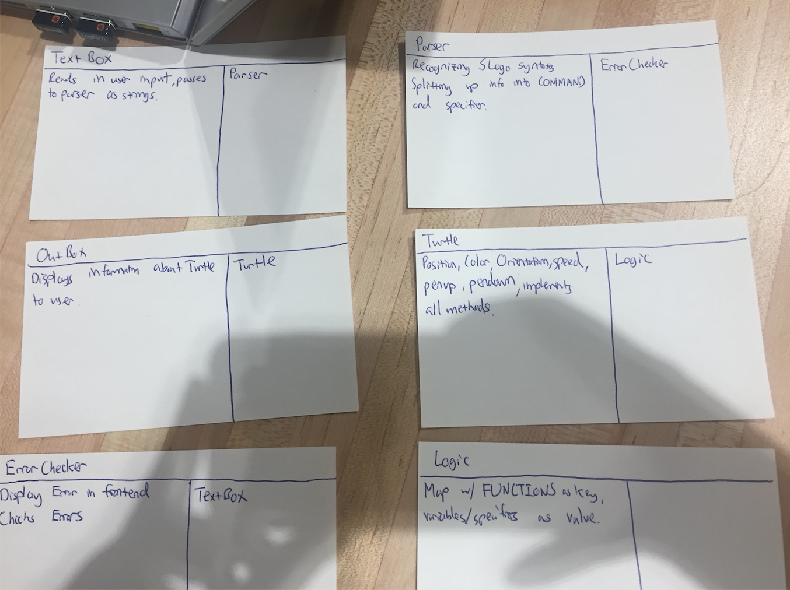

**Shouldn't be part of API**

GridView/step

GridLogic/step

**External**

Cell/getColor

CellGraph class

GridController/init

GridController/stepSimulation

GridController/getTitle

GridController/startSimulation

GridController/stopSimulation

MainMenu/init

**Internal**

Cell/calculateNextState

Cell/setCoords

AlertBox/displayError

GridController/parseFile

GridController/step

GridFactoryException class

GridLogic class

**Both Internal/External**

Cell/getCoordsX

Cell/getCoordsY

GridFactory/getCellShape

**Parsing API**
public class Parser()
    public parser(String s)
    public String[] getCommands()
