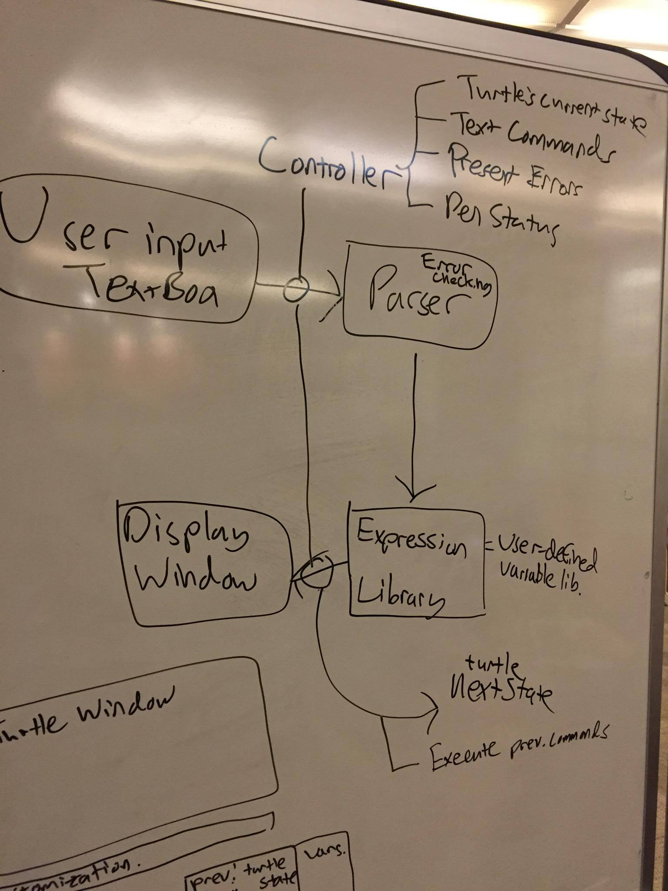

# Introduction
The goal of our team is to develop an integrated development environment that allows users to write SLogo progams that control turtle movements on a per expression basis. The IDE should help users experiment with and manage expressions. Eventually users should be able to use previous expressions to develop complex expressions and view the appropriate visual turtle representation in real time.
The primary design goals of this project are to develop a seamless and quick loop of communication between the front end and back end, create a GUI that has user-friendly error-checking and a large variety of customization options, an updatable library of SLogo expressions, 
Parts of the architecture will be open so that other programmers will easily be able to add to the library of executable SLogo expressions, 

# Design Overview
We first considered a high level overview of the data flow through our project. We started from the user input textbox view where users would input commands. The input would travel to the controller, which would transfer the input to a parser. The parser would error check the command at some point and send an error to the view to display for the user. Successfully parsed commands get stored in an expression library or a user defined variable library. Then, the controller manipulates the logic from each expression and gives the display window view enough information that it needs.

# User Interface
Users type in commands into an input text box.  Also easily accessible are previously used expressions, the turtle state variables, and any other variables that the user has defined.  Users can change the color of the turtle window through the customization drop down box.  The turtle window displays the orientation and color of the turtle.
.jpg)

# API Details
UI Input 

String getText();

String getLanguage();

String convertExpression(button);

String convertVar(button);	

# UI Output
Need:

Turtle getTurtleState(); //method to get turtle state and update turtle view

List<Expression> getPrevExpressions(); //to update prev expression view

List<Expression> variableExpressions(); // to update var expression view

Provide:

Void clickPrevExpression(Expression);

Void clickVarExpression(Expression);

Turtle getCurrentTurtleState();
	
# UI Output Classes:
TurtleView

ExpressionView

PrevExpressionView

List<Expression> prevExpressions

VariableExpressionView

List<Expression> varExpressions

**Controller**

Turtle getTurtle();

Void setTurtle(Turtle t);

Expression parseString(String s, Language language);

InputFormatException();

Void setVar();

**Turtle Class**

Position, orientation, color, pen trail, visibility properties

**Error Class**

displayErrorBox()

Logic - supports the execution of the logic behinds the various commands included in the SLogo basic commands, including turtle movement and change in turtle display and various math commands. It will contain the interface Logic, which will provide a basis upon which the other logic classes can be built, the classes MathLogic, which will implement Logic and execute math operations, BooleanLogic, which will implement Logic and execute the boolean commands, TurtleLogic, which will implement Logic and execute the Turtle commands and queries, and LogicManager, which will determine the type of command and delegate it to one of the implementations of Logic.

**Logic API Methods:**

executeCommand(String[] commands, String[] variables); 

Turtle getTurtle(Turtle t);

String getVarState(String varName);

String[] getPreviousExpression();

TurtleLogicException();

# API Example Code
**“Fd 50”**
UI input calls getText() as well as getLanguage(), returns text and language. UI then passes the string values into the Controller.

command <-- parseString(text, language)

Variable <-- parseString(text, language)

executeCommand(command, variable)

turtle<--getTurtle()

controller.setTurtle(turtle)

Output accesses controller.getTurtle();

display(turtle)

**User clicks on previous expression Fd 50**

UI input gets previous expression using getPrevExpression() from output view and calls convertExpression(button) where button is the expression that was clicked by the user. UI passes the string value of the button into the Controller as well as the language. 

Refer to previous Controller example.

**“User clicks on variable, types in new value of variable in input text box.”**

UI input calls convertVar(button), which returns the name of the variable in the form of a string. UI input calls getText(), which returns the new string value of the variable.

Controller calls setVar(var, value), which uses the variable and value parameters passed in from input to create new variable.

**“User types in ‘dog’”**

UI input calls getText() as well as getLanguage(), returns text and language. UI then passes the string values into the Controller.	

command<--parseString(text, language)

parseString calls displayErrorBox() because expression does not follow the syntax guidelines

displayErrorBox()

**“User clicks reset button”**

UI input lets controller know that reset button was hit. Controller tells models to become default turtle state. Model then updates view telling it to reset to new values.

# Design Considerations
Issues that were addressed were how many controllers were needed to link the front end and back end.  We first considered whether or not we should have one controller linking the user input to the parser, and another separate controller linking the expression library to the display window.  In the end, however, we decided that it would be best to have one controller because this allows for all parts of the front end and back end to access all available information, allowing for more extensibility in the long run if the roles of the front end and back end were to change.

An issue that we discussed at length was the amount of access that the controller should have to the different parts of the Model and View and the dependencies between the three. In the end, we decided to give the controller access to everything that the two shared, meaning that both the Model and the View would be dependent on the Controller, but not on one another. We thought that this would make our program more easily extendable because changes to the Model would not affect the View and vice versa, they would only need to be dealt with in the controller.

Another issue that we discussed at length was how we should store the different input strings and the commands they represent. In the end, we decided to split them up between different maps, one for each set of commands (e.g. math commands, turtle commands), as opposed to storing all of the commands. Though this would make it more difficult to find each command initially, in the end, it would allow us to more easily have different classes for each different library of commands, which would help us separate classes and allow us to more easily implement new libraries of commands.

# Team Responsibilities
Chris - in charge of creating classes to fulfill the UI Input API, Model (where turtle’s current state is stored.)

Alan - in charge of creating classes to fulfill the UI Output API

Katrina - in charge of creating classes to fulfill the Controller API

Larissa - in charge of creating classes to fulfill the UI Input API

